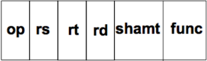
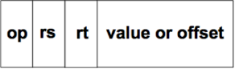
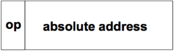

# รายงานวิชา CN210 สถาปัตยกรรมคอมพิวเตอร์ (Computer Architecture)

### สรุปเนื้อหา (ยังไม่สมบูรณ์)

1. Computer ประกอบด้วย
   * CPU (Central processing unit)
   * Input/Output
   * Main Memory
   
2. CPU ประกอบด้วย
    * ALU (Arithermathic and logical unit)
    * Control Unit
    * Register
3. MIPS Instruction format ประกอบด้วย
    * R-format
    
    
    
    * I-format
    
    
    
    * J-format
    
    
    
4. การบ้านครั้งที่ 1 (คำสั่ง ADD)
    * คำสั่ง ADD เป็นคำสั่งรูปแบบ R-format ซึ่งเขียนได้ดังนี้ add $rd,$rs,$rt โดยทำงานจะเป็นตามตัวอย่าง add $5,$1,$2 ต่อไปนี้
    * โดย คำสั่ง ADD นั้นจะถูกแบ่งออกเป็น 6 ส่วน คือ
        
          ส่วนที่ 1 opcode (จำนวน 6 bits) จะเป็นตัวบอกว่าเป็นคำสั่ง format ใด ซึ่งคำสั่ง ADD 
                 นั้นเป็น R-format ดังนั้น opcode จึงเป็น 000000
             
          ส่วนที่ 2 $rs (จำนวน 5 bits) ซึ่งในตัวอย่าง $rs คือ $1 จึงเป็น 00001 
          
          ส่วนที่ 3 $rt (จำนวน 5 bits) ซึ่งในตัวอย่าง $rt คือ $2 จึงเป็น 00010 
          
          ส่วนที่ 4 $rd (จำนวน 5 bits) ซึ่งในตัวอย่าง $rd คือ $5 จึงเป็น 00101  
          
          ส่วนที่ 5 shamt (จำนวน 5 bits) มีค่าเป็น 00000 เนื่องจากไม่มีการใช้งาน
          
          ส่วนที่ 6 func (จำนวน 6 bits) เนื่องจากเป็นคำสั่ง ADD ค่าจึงเป็น 100000
        
       ซึ่งรวมกันได้เป็น 0000 0000 0010 0010 0010 1000 0010 0000 หรือ 00222820 ในเลขฐาน 16

    * [คลิปการบ้านครั้งที่ 1](https://youtu.be/Tj96dnA5ybM)

[การบ้านครั้งที่ 2](https://youtu.be/K7KxPubbLcY)

[การบ้านครั้งที่ 3](https://youtu.be/kSDwzSKG6SQ)

[การบ้านครั้งที่ 4](https://youtu.be/IfmJNEMieOw)

[การบ้านครั้งที่ 5](https://youtu.be/PX9spgevC18)

[การบ้านครั้งที่ 6](https://youtu.be/FJwCxofdXOI)

[การบ้านครั้งที่ 7](https://youtu.be/CLlpdwgUzqw)
