# รายงานวิชา CN210 สถาปัตยกรรมคอมพิวเตอร์ (Computer Architecture)

### สรุปเนื้อหา

1. **Computer ประกอบด้วย**
   * CPU (Central processing unit)
   * Input/Output
   * Main Memory
   
2. **CPU ประกอบด้วย**
    * ALU (Arithermathic and logical unit)
    * Control Unit
    * Register
    
3. **MIPS Instruction format ประกอบด้วย**
    * R-format
    
    
    
    * I-format
    
    
    
    * J-format
    
    
    
4. **การบ้านครั้งที่ 1 (คำสั่ง add)**
    * คำสั่ง add เป็นคำสั่งรูปแบบ R-format ซึ่งเขียนได้ดังนี้ add $rd,$rs,$rt โดยทำงานจะเป็นตามตัวอย่าง add $5,$1,$2 ต่อไปนี้
    * โดย คำสั่ง add นั้นจะถูกแบ่งออกเป็น 6 ส่วน คือ
        
          คำสั่ง add $5,$1,$2
          
          ส่วนที่ 1: opcode (จำนวน 6 bits) จะเป็นตัวบอกว่าเป็นคำสั่ง format ใด ซึ่งคำสั่ง add 
                  นั้นเป็น R-format ดังนั้น opcode จึงเป็น 000000
             
          ส่วนที่ 2: $rs (จำนวน 5 bits) ซึ่งในตัวอย่าง $rs คือ $1 จึงเป็น 00001 
          
          ส่วนที่ 3: $rt (จำนวน 5 bits) ซึ่งในตัวอย่าง $rt คือ $2 จึงเป็น 00010 
          
          ส่วนที่ 4: $rd (จำนวน 5 bits) ซึ่งในตัวอย่าง $rd คือ $5 จึงเป็น 00101  
          
          ส่วนที่ 5: shamt (จำนวน 5 bits) มีค่าเป็น 00000 เนื่องจากไม่มีการใช้งาน
          
          ส่วนที่ 6: func (จำนวน 6 bits) เนื่องจากเป็นคำสั่ง add ค่าจึงเป็น 100000
        
       ซึ่งรวมกันได้เป็น 0000 0000 0010 0010 0010 1000 0010 0000 หรือ 00222820 ในเลขฐาน 16

    * [**คลิปวีดีโอการบ้านครั้งที่ 1**](https://youtu.be/Tj96dnA5ybM)

5. **การบ้านครั้งที่ 2 (การอธิบายการทำงานของคอมพิวเตอร์)**
    * โดยในการอธิยบายนั้นจะใช้ตัวอย่างต่อไปนี้
           
           j 01000000
           lw $9, 4($0)
           lw $1, 0($9)
           lw $2, 4($9)
           add $3, $1, $2
           sw $3, 8($9)
           
    * การทำงานของคอมพิวเตอร์จากตัวอย่าง
           
           1. ในคำสั่งแรกนั้นที่เป็น j 01000000 ที่เป็นการ jump สามารถแปลงเป็นเลขฐาน 2
              ได้เป็น 0000 1000 0100 0000 0000 0000 0000 0000
              และจะทำงานนำ 6 bits แรกออกแล้วเติม 0 ข้างหน้า 4 ตัว และข้างหลัง 2 ตัว
              ได้เป็น 0000 0001 0000 0000 0000 0000 0000 0000 
              แล้วทำการ jump ไปยัง address นั้น
              
           2. ในคำสั่งที่ 2 หรือก็คือ lw $9, 4($0) นั้นเป็นการ load word จากการตรวจสอบ
              เลขฐาน 2 ที่แปลงได้คือ 100011 00000 01001 0000 0000 0000 0100
              ทำให้ทราบว่า opcode คือ 100011 แสดงว่าเป็นการทำ load word
              คอมพิวเตอร์จะทำการนำ ข้อมุลจาก $rs หรือ $0 ไปบวกกับค่า offset
              ที่มีค่าเป็น 4 แล้วนำไปใส่ไว้ยัง $rt หรือ $9
              
           3. ในคำสั่ง 3 และ 4 นั้น lw $1, 0($9) และ lw $2, 4($9) 
              ก็จะเป็นไปในลักษณะเดียวกันกับคำสั่งที่ 2
             
           4. ในคำสั่งที่ 5 หรือก็คือ add $3, $1, $2 นั้นเป็นการ add จากการตรวจสอบ
              เลขฐาน 2 ที่แปลงได้คือ 000000 00001 00010 00011 00000 100000
              ทำให้ทราบว่า opcode คือ 000000 แสดงว่าเป็น R-format และ function
              คือ add จาก 100000 (6 bits ท้าย) จึงนำ $1 กับ $2 มาบวกกัน
              แล้วนำไปไว้ที่ $3
              
           5. ในคำสั่งที่ 6 หรือก็คือ sw $3, 8($9) นั้นเป็นการ store word จาก
              เลขฐาน 2 ที่แปลงได้คือ 101011 01001 00011 0000 0000 0000 1000
              ทำให้ทราบว่า opcode คือ 101011 แสดงว่าเป็นการทำ store word
              คอมพิวเตอร์จะทำการนำ ข้อมุลจาก $rs หรือ $9 ไปบวกกับค่า offset
              ที่มีค่าเป็น 8 แล้วนำไป store $rt หรือ $3
    
    * [**คลิปวีดีโอการบ้านครั้งที่ 2**](https://youtu.be/K7KxPubbLcY)

6. **การบ้านครั้งที่ 3 (ความแตกต่างระหว่าง Single cycle กับ Multi cycle)**
    * Single cycle
          
          - การเก็บข้อมูลกับชุดคำสั่งจะเก็บไว้แยกจากกัน
          
          - ทุกการทำงานของคำสั่งใน single cycle จะจบลงใน 1 cycle
          
          - มี ALU อยู่หลายตัว
          
    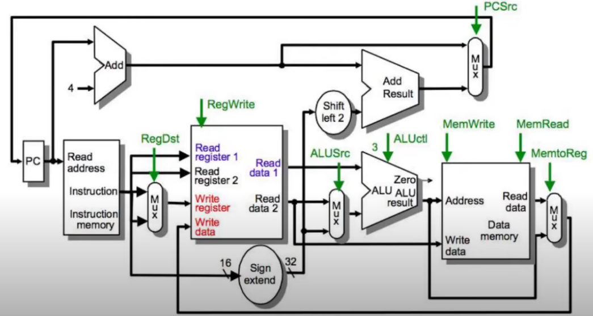
          
    * Multi cycle
          
          - การเก็บข้อมูลกับชุดคำสั่งจะเก็บไว้ในที่เดียวกัน
          
          - การทำงานของคำสั่งใน Multi cycle หลาย cycle
          
          - มี ALU อยู่ตัวเดียว
          
    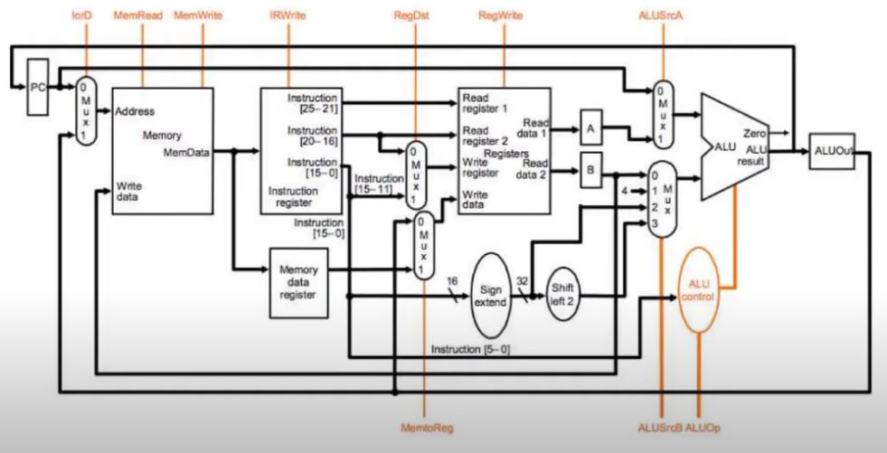
          
    * [**คลิปวีดีโอการบ้านครั้งที่ 3**](https://youtu.be/kSDwzSKG6SQ)
    
7. **การบ้านครั้งที่ 4 (การทำงานของคำสั่ง lw ใน Multi cycle)**
   
   การทำงานของคำสั่ง lw ใน Multi cycle จะมีอยู่ด้วยกันทั้งหมด 5 cycle ดังนี้
    * Cycle ที่ 1
          
          นำข้อมูลที่รับเข้ามาจาก PC แล้วนำไปเก็บไว้ที่ Instruction register
          
    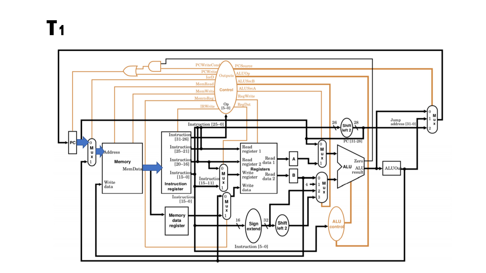
    * Cycle ที่ 2 
    
          นำ $rs ไปไว้ที่ A และนำ offset ไปไว้ที่ Sign extend
          
    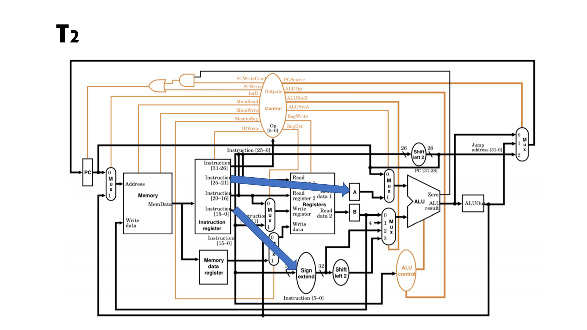
    * Cycle ที่ 3
    
          นำ $rs มาคำนวณกับ offset ที่ ALU แล้วนำผลไปเก็บไว้ที่ ALUOut
          
    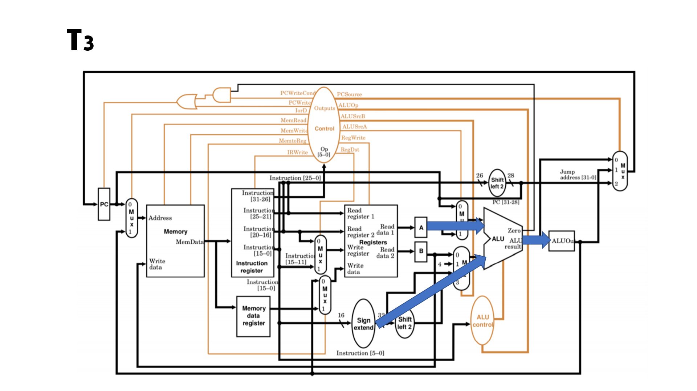
    * Cycle ที่ 4
    
          นำผลจาก ALUOut กลับไปยัง Memory แล้วนำไปไว้ที่ Memory data register
          
    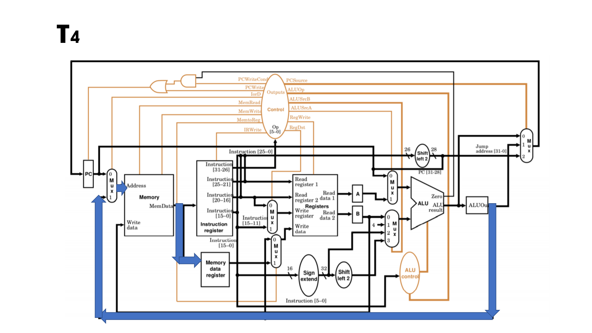
    * Cycle ที่ 5
    
          นำค่าจาก Memory data register กับ $rt ไปไว้ใน register 
          เพื่อทำการนำค่าจาก Memory data register ไปเขียนไว้ที่ $rt
          
    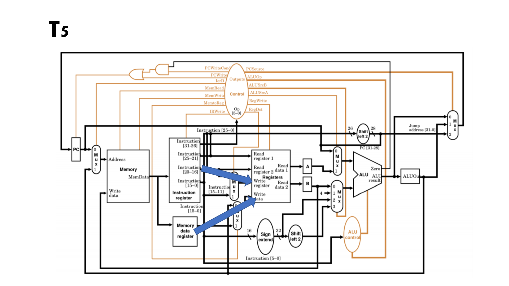      
    
    * [**คลิปวีดีโอการบ้านครั้งที่ 4**](https://youtu.be/IfmJNEMieOw)
    
8. **การบ้านครั้งที่ 5 (การทำงานของคำสั่ง beq ใน Multi cycle)**

   คำสั่งของ beq จะมีรูปร่างดังนี้ beq $rs,$rt,offset โดยใน Multi cycle จะทำงานอยู่ด้วยกัน 3 cycle
   * Cycle ที่ 1
          
          นำข้อมูลที่รับเข้ามาจาก PC แล้วนำไปเก็บไว้ที่ Instruction register
          
   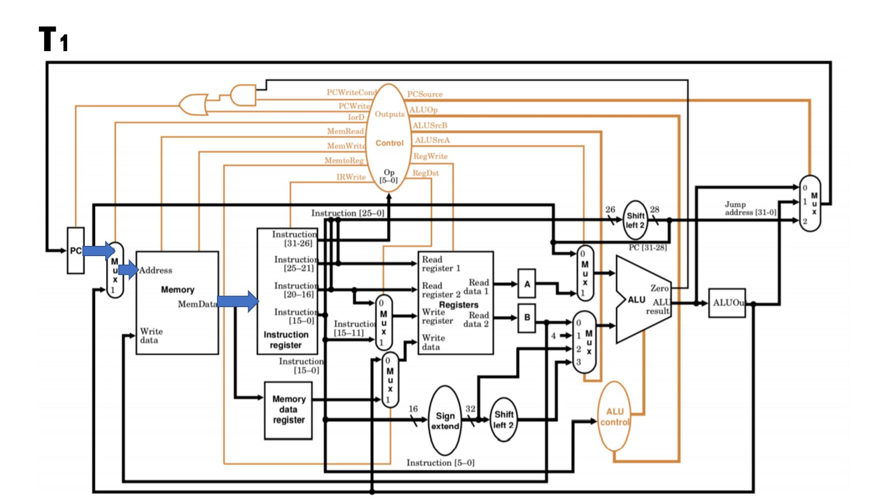
   * Cycle ที่ 2
   
          นำค่าตำแหน่งจาก PC ไปคำนวณกับ offset ที่ ALU แล้วนำไปเก็บไว้ที่ ALUOut
          แล้วนำ $rs ไปไว้ที่ A และ $rt ไปไว้ที่ B
          
   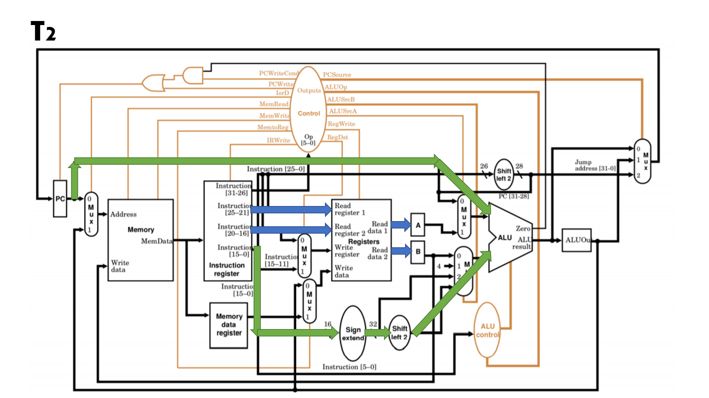
   * Cycle ที่ 3
   
          นำ A กับ B มาลบกันถ้าค่าที่ได้เป็น 0 ให้นำค่าจาก ALUOut ไปไว้ที่ PC
          
   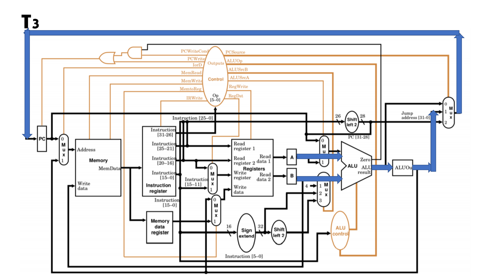
   
   * [**คลิปวีดีโอการบ้านครั้งที่ 5**](https://youtu.be/PX9spgevC18)
   
9. **การบ้านครั้งที่ 6 (การทำงานของคำสั่ง R-format ใน Multi cycle)**
   * Cycle ที่ 1
   
          MemRead=1 ; เป็นการให้อ่านค่าใน Memory
          IorD=0 และ IRWrite=1 ; นำค่าจาก PC ไปไว้ใน Memory แล้วนำไปไว้ที่ Register
          ALUSrcA=0 ; นำค่าจาก PC มาเป็น A
          ALUSrcB=1 ; ค่าของ B จะมีค่าเป็น 4
          ALUOP=ADD ; นำ A บวกกับ B กัน
          PCWrite=1 และ PCSource=1 ; นำผลของ A บวก B ไปไว้ที่ PC
          
   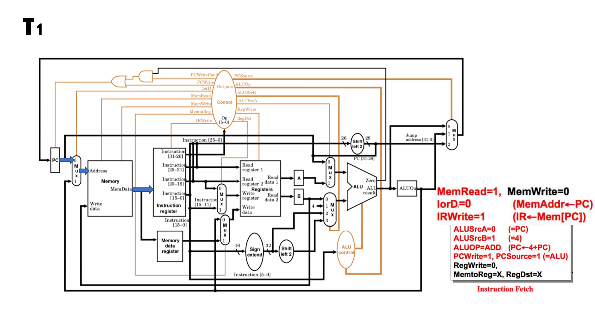
   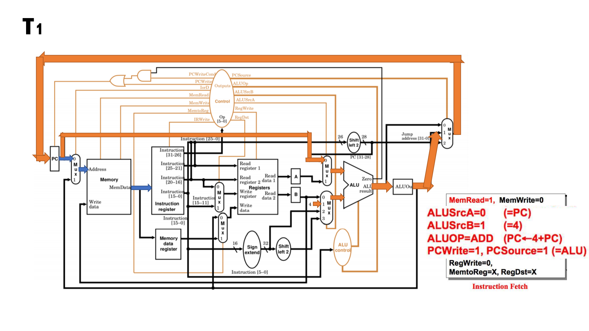
   * Cycle ที่ 2
   
          ในขั้นตอนนี้จะเป็นการนำค่า offset มาคำนวณแต่ในรูปแบบ R-format นั้นไม่มี
          จึงไม่เกิดการคำนวณ
   
   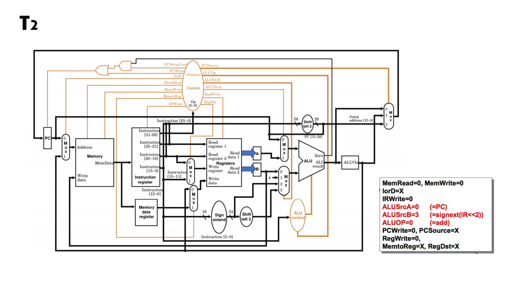
   * Cycle ที่ 3
   
          ALUSrcA=1 ; นำค่าจาก $rs นำไปไว้ที่ A
          ALUSrcB=0 ; นำค่าจาก $rs นำไปไว้ที่ B
          ALUOP=2 ; นำ A มาคำนวณ B กัน
   
   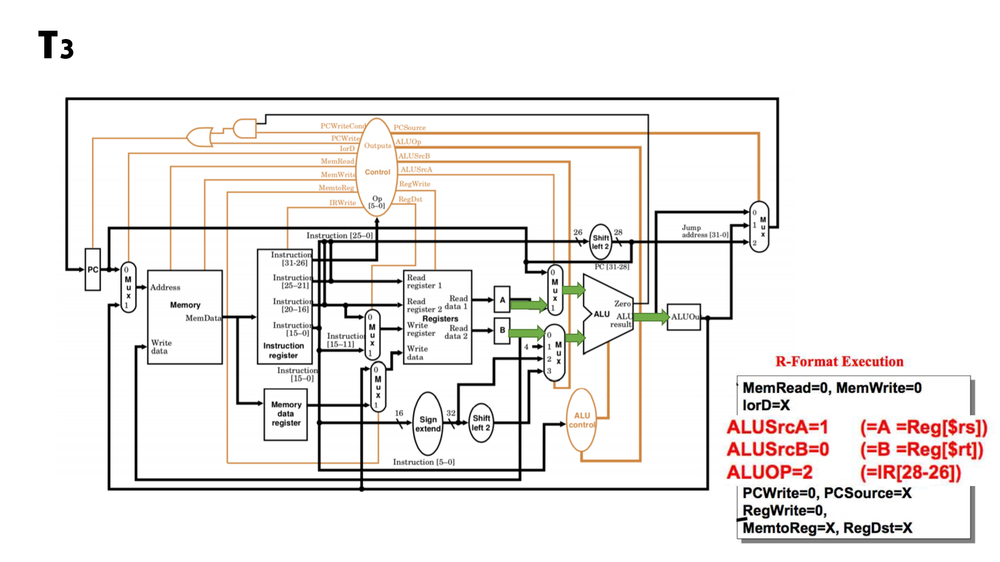
   * Cycle ที่ 4
   
          MemtoReg=0 ; นำค่าใน ALUOut ไปไว้ใน Register
          RegDst=1 ; นำค่าจาก $rd ไปไว้ใน Register
          RegWrite=1 ; นำค่าจาก ALUOut ไปเขียนไว้บน $rd
   
   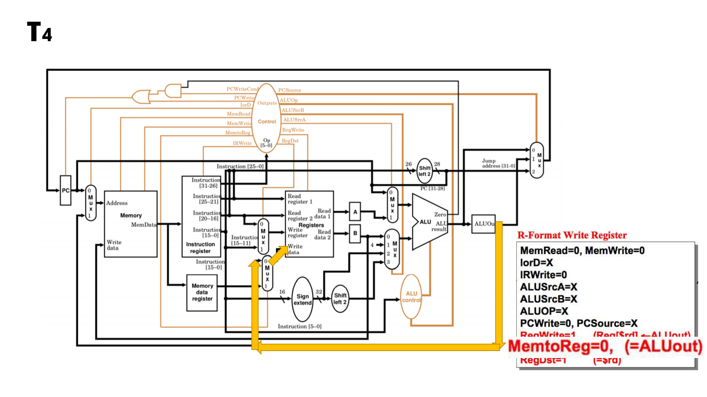
   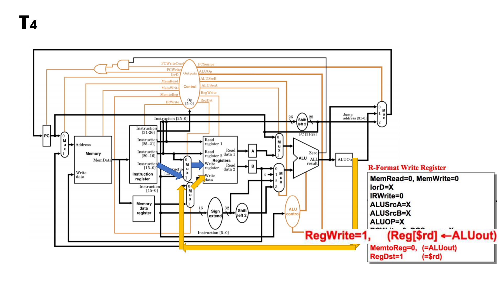
   * [**คลิปวีดีโอการบ้านครั้งที่ 6**](https://youtu.be/FJwCxofdXOI)

10. **การบ้านครั้งที่ 7 (Pipelining)**
    * การทำงานของ Pipelining
          
          การทำงานของ Pipelining นั้นจะเป็นการทำงานโดยให้อุปกรณ์ทุกตัวนั้นทำงานพร้อมกัน
          เพื่อเร่งให้การประมวลผลมีความเร็วที่มากขึ้น ไม่ได้ทำงานแบบเป็น cycle แบบทำแบบที่ละชุดทำสั่ง

    * [**คลิปวีดีโอการบ้านครั้งที่ 7**](https://youtu.be/CLlpdwgUzqw)
